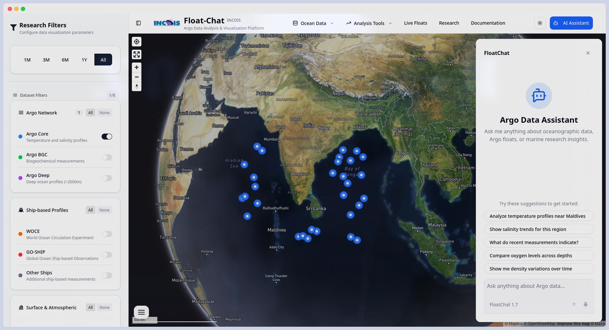
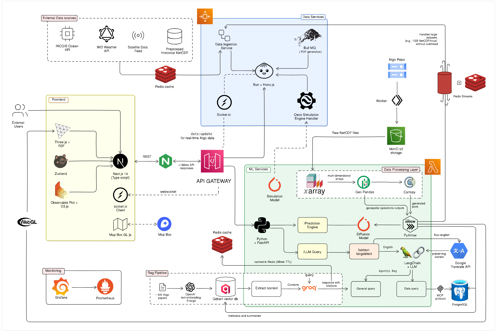

# Atlas: Argo Data Visualization Platform



A comprehensive prototype platform for visualizing Argo float data with integrated AI capabilities, developed for the Indian National Centre for Ocean Information Services (INCOIS), Government of India under SIH.

## About INCOIS

The Indian National Centre for Ocean Information Services [(INCOIS)](https://incois.gov.in/site/index.jsp) is an autonomous organization under the Ministry of Earth Sciences, Government of India. INCOIS provides ocean information and advisory services to support the blue economy, sustainable development, and marine safety.

## Features

### Data Visualization

- **Interactive Argo Float Maps**: Real-time visualization of Argo float deployments and trajectories
- **Oceanographic Profiles**: Temperature, salinity, and other parameter profiles
- **Trajectory Analysis**: Animated trajectories with time-based filtering
- **Multi-parameter Charts**: Comprehensive data analysis with interactive charts

### AI Integration

- **Intelligent Chat Interface**: AI-powered queries about ocean data and patterns
- **Data Insights**: Automated analysis and pattern recognition
- **Natural Language Processing**: Query ocean data using conversational language

### Advanced Analytics

- **Time Period Selection**: Flexible temporal filtering of ocean data
- **Deployment Year Filtering**: Historical analysis capabilities
- **Data Download**: Export capabilities for research and analysis
- **Battery Monitoring**: Real-time monitoring of float battery status

## Technology Stack

### Frontend

- **Next.js 15**: React framework with App Router
- **TypeScript**: Type-safe development
- **Tailwind CSS**: Utility-first CSS framework
- **Radix UI**: Accessible component library

### Mapping & Visualization

- **Leaflet & Mapbox**: Interactive mapping capabilities
- **D3.js**: Data-driven document manipulation
- **Recharts & Plotly**: Advanced charting libraries
- **React-Leaflet**: React integration for Leaflet maps



### AI & Data Processing

- **Groq AI**: Fast inference for AI queries
- **Google Generative AI**: Advanced language models
- **Qdrant**: Vector database for semantic search
- **AI SDK**: Unified AI integration

### Development Tools

- **Biome**: Fast linter and formatter
- **shadcn/ui**: Modern UI components
- **Zustand**: State management

## Getting Started

First, install the dependencies:

```bash
bun install
```

## Database Setup

This project uses PostgreSQL with Drizzle ORM.

1. Make sure you have a PostgreSQL database set up.
2. Update your `apps/server/.env` file with your PostgreSQL connection details.

3. Apply the schema to your database:

```bash
bun run db:push
```

Then, run the development server:

```bash
infisical run --env=dev bun run dev
```

> **Note**: We use `infisical` for our secret management. For more info on how to setup, visit [here](https://infisical.com/docs/cli/usage#feed-secrets-to-your-application)

Open [http://localhost:3001](http://localhost:3001) in your browser to see the web application.
The API is running at [http://localhost:3000](http://localhost:3000).

## Project Structure

```
atlas/
├── apps/
│   ├── web/         # Frontend application (Next.js)
│   └── server/      # Backend API (Hono, TRPC)
├── packages/
│   ├── api/         # API layer / business logic
│   └── db/          # Database schema & queries
```

## Available Scripts

- `bun run dev`: Start all applications in development mode
- `bun run build`: Build all applications
- `bun run dev:web`: Start only the web application
- `bun run dev:server`: Start only the server
- `bun run check-types`: Check TypeScript types across all apps
- `bun run db:push`: Push schema changes to database
- `bun run db:studio`: Open database studio UI

## Acknowledgments

- Argo Program for providing ocean data
- Ministry of Earth Sciences, Government of India
- Open source community for the amazing tools and libraries
- Smart India Hackathon for the opportunity
