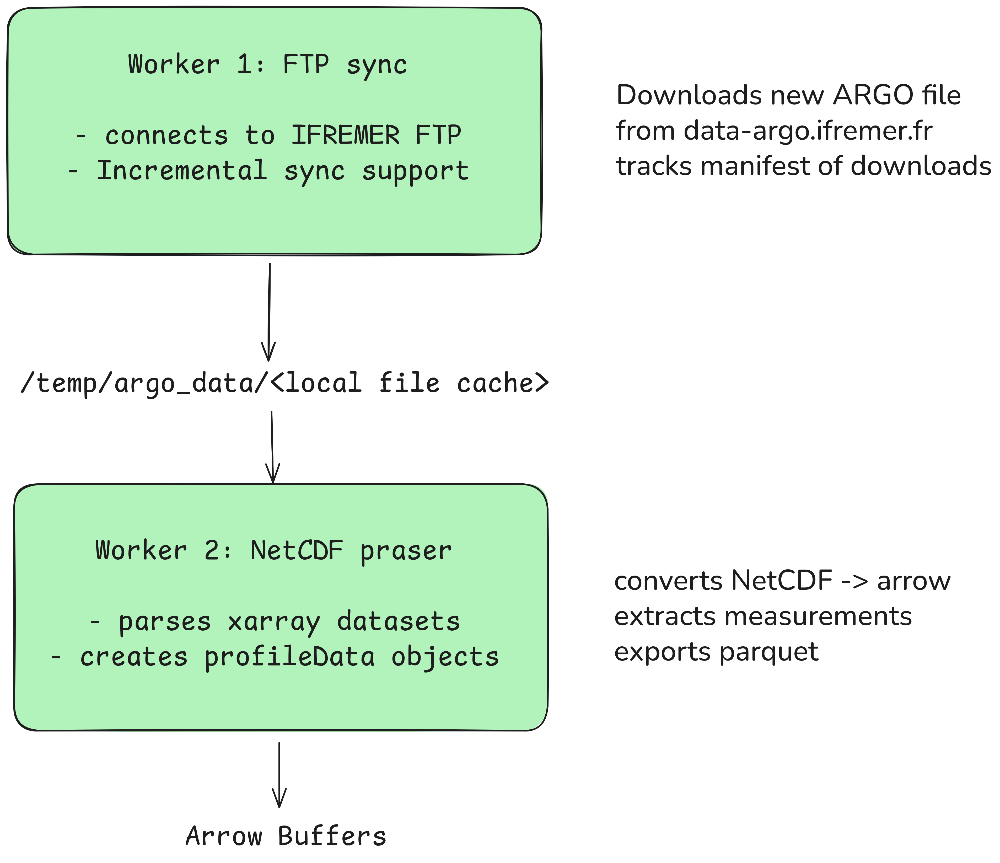

# ARGO Data Processing Workers

This package contains Python workers for processing oceanographic ARGO float data from the `data-argo.ifremer.fr` repository. It's designed to be deployed as AWS Lambda functions.

## Architecture Overview

The package consists of two main workers in the data pipeline:


## Package Structure

```
src/atlas_workers/
├── __init__.py              # Package exports
├── config.py                # Configuration management (Pydantic Settings)
├── models/
│   ├── argo.py              # Data models (FloatMetadata, ProfileData)
│   └── __init__.py
├── utils/
│   ├── logging.py           # Structured logging setup
│   └── __init__.py
└── workers/
    ├── ftp_sync.py          # Worker #1: Download ARGO data
    ├── netcdf_parser.py     # Worker #2: Parse NetCDF files
    └── __init__.py

tests/
├── conftest.py              # Pytest configuration
├── test_ftp_sync.py         # FTP worker tests
└── test_netcdf_parser.py    # Parser worker tests
```

## Worker #1: FTP Sync

Downloads ARGO float data from the IFREMER repository.

### Features

- **Incremental Sync**: Only downloads new/modified files
- **Manifest Tracking**: Remembers downloaded files
- **Concurrent Downloads**: Parallel processing via asyncio
- **HTTP Fallback**: Uses HTTPS when FTP unavailable
- **Retry Logic**: Automatic retries on network failures

### Usage

```python
import asyncio
from atlas_workers.workers import FTPSyncWorker

async def main():
    worker = FTPSyncWorker(
        ftp_server="data-argo.ifremer.fr",
        dac="incois",
        cache_path="/tmp/argo_data"
    )

    # Sync all floats
    result = await worker.sync()
    print(f"Downloaded: {result['files_downloaded']} files")

    # Sync specific floats
    result = await worker.sync(float_ids=["2902224", "2902225"])
    print(f"Synced specific floats: {result['files_downloaded']} files")

asyncio.run(main())
```

### Command Line

```bash
# Run worker directly
python -m src.atlas_workers.workers.ftp_sync

# With specific float IDs
export FLOAT_IDS="2902224,2902225"
python -m src.atlas_workers.workers.ftp_sync
```

### Configuration

Via `config.py` or `.env`:

```ini
FTP_SERVER=data-argo.ifremer.fr
FTP_PORT=21
FTP_TIMEOUT=300
FTP_MAX_RETRIES=3
FTP_RETRY_DELAY=5
ARGO_DAC=incois
LOCAL_CACHE_PATH=/tmp/argo_data
ENABLE_INCREMENTAL_SYNC=true
HTTP_BASE_URL=https://data-argo.ifremer.fr
HTTP_TIMEOUT=30
HTTP_MAX_RETRIES=3
```

### Output

Returns sync statistics:

```json
{
  "total_floats": 312,
  "files_downloaded": 150,
  "files_skipped": 2050,
  "bytes_downloaded": 3145728,
  "errors": 0,
  "start_time": "2025-11-07T10:30:00.000000",
  "end_time": "2025-11-07T10:45:00.000000"
}
```

## Worker #2: NetCDF Parser

Converts NetCDF ARGO files to structured data formats (Arrow/Parquet/JSON).

### Features

- **Multi-format Export**: JSON, Arrow/Parquet
- **Automatic Type Detection**: Safely handles missing values
- **Profile Statistics**: Calculates min/max/avg for each profile
- **Quality Flags**: Preserves data quality indicators
- **Batch Processing**: Process entire float directories

### Usage

```python
from pathlib import Path
from atlas_workers.workers import NetCDFParserWorker

worker = NetCDFParserWorker(cache_path="/tmp/argo_data")

# Parse single file
profiles = worker.parse_profile_file(
    Path("/tmp/argo_data/incois/2902224/R2902224_001.nc")
)
print(f"Parsed {len(profiles)} profiles")

# Process entire float directory
stats = worker.process_directory("2902224")
print(f"Total profiles: {stats['profiles_parsed']}")

# Export to different formats
# JSON format
worker.export_to_json(
    profiles,
    Path("/tmp/profiles.json")
)

# Arrow/Parquet format
worker.export_to_arrow(
    profiles,
    Path("/tmp/profiles.parquet")
)
```

### Command Line

```bash
# Run parser directly
python -m src.atlas_workers.workers.netcdf_parser

# Process specific float
FLOAT_ID=2902224 python -m src.atlas_workers.workers.netcdf_parser
```

### Configuration

```ini
OUTPUT_ARROW_FORMAT=true
ARROW_COMPRESSION=zstd
PROFILE_BATCH_LIMIT=None  # None = all, or limit to number
BATCH_SIZE=10
MAX_WORKERS=4
```

### Data Models

The parser returns `ProfileData` objects with full Pydantic validation and serialization:

```python
from datetime import datetime
from typing import Any, Optional
from pydantic import BaseModel, Field

class ProfileData(BaseModel):
    float_id: str = Field(..., description="WMO float ID")
    cycle_number: int = Field(..., description="Profile cycle")
    profile_time: datetime = Field(..., description="Time of measurement")
    latitude: float = Field(..., description="Surface latitude")
    longitude: float = Field(..., description="Surface longitude")
    measurements: list[MeasurementProfile] = Field(
        default_factory=list, description="Depth profiles"
    )
    max_depth: Optional[float] = Field(None, description="Maximum depth reached")
    quality_status: Optional[str] = Field(
        "REAL_TIME", description="REAL_TIME or DELAYED"
    )
    metadata: Optional[dict[str, Any]] = Field(None, description="Additional info")

class MeasurementProfile(BaseModel):
    depth: float = Field(..., description="Pressure in meters")
    temperature: Optional[float] = Field(None, description="°C")
    salinity: Optional[float] = Field(None, description="PSU (Practical Salinity Units)")
    oxygen: Optional[float] = Field(None, description="µmol/kg (dissolved O2)")
    chlorophyll: Optional[float] = Field(None, description="mg/m³")
    qc_flags: Optional[dict[str, int]] = Field(
        None, description="Quality control flags"
    )
```

These Pydantic models provide automatic validation, JSON serialization, and type safety.

### Output Examples

**JSON Format:**

```json
[
  {
    "float_id": "2902224",
    "cycle_number": 320,
    "profile_time": "2025-11-06T03:20:00",
    "latitude": -4.8,
    "longitude": 72.1,
    "measurements": [
      {
        "depth": 0.0,
        "temperature": 15.2,
        "salinity": 34.5,
        "oxygen": 210.0,
        "chlorophyll": 0.8
      },
      {
        "depth": 1000.0,
        "temperature": 2.5,
        "salinity": 34.7,
        "oxygen": 145.0,
        "chlorophyll": 0.5
      }
    ],
    "max_depth": 2087.0,
    "quality_status": "REAL_TIME"
  }
]
```

**Arrow/Parquet Format:**

Columnar data optimized for storage and analytics:

- `float_id` (string)
- `cycle_number` (int64)
- `profile_time` (timestamp)
- `latitude`, `longitude` (float64)
- `max_depth` (float64)
- `measurement_count` (int32)

## Data Flow

```
1. FTP Sync Downloads Files
   ↓
2. Files stored at /tmp/argo_data/incois/[float_id]/
   ↓
3. NetCDF Parser reads files
   ↓
4. Extracts ProfileData objects
   ↓
5. Exports to Arrow/Parquet (compressed columnar format)
   ↓
6. Ready for database ingestion (PostgreSQL → Redis HOT layer)
   ↓
7. Dashboard receives data via API
```

## Quick Start

### Prerequisites

- Python 3.11+
- `uv` package manager (recommended)

### Local Development Setup

```bash
cd apps/workers

uv sync
```

### Environment Configuration

Create a `.env` file in the workers directory:

```bash
# FTP Configuration
FTP_SERVER=data-argo.ifremer.fr
FTP_PORT=21
ARGO_DAC=incois
LOCAL_CACHE_PATH=/tmp/argo_data

# Processing
BATCH_SIZE=10
MAX_WORKERS=4
PROFILE_BATCH_LIMIT=5  # Limit for testing, None for all

# Logging
LOG_LEVEL=INFO
LOG_FORMAT=json  # or 'text'
ENVIRONMENT=development
```

## Testing

Run the full test suite:

```bash
# With uv
uv run pytest tests/ -v

# Run specific test
uv run pytest tests/test_ftp_sync.py::test_sync_worker_initialization -v

# With coverage
uv run pytest tests/ --cov=src/atlas_workers --cov-report=html
```

### Test Files

- `tests/test_ftp_sync.py` - FTP worker tests
- `tests/test_netcdf_parser.py` - Parser worker tests
- `tests/conftest.py` - Pytest fixtures
