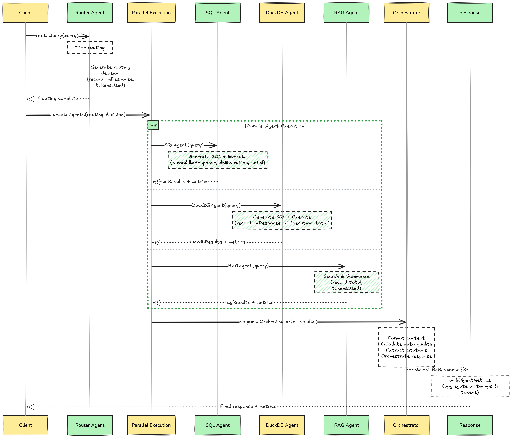

# Multi-Agent Architecture

This document outlines the multi-agent architecture used in the Atlas API Gateway to handle complex oceanographic queries. The system uses a router-orchestrator pattern to delegate tasks to specialized agents and synthesize their results into a comprehensive scientific response.

## Overview

The architecture is designed to handle three distinct types of data/knowledge:

1.  **Structured Metadata**: Float locations, status, and technical details (PostgreSQL).
2.  **High-Volume Time-Series**: Temperature, salinity, and pressure profiles (DuckDB/Parquet).
3.  **Unstructured Knowledge**: Scientific literature and research papers (RAG).

Instead of a single monolithic agent, we use a **Router** to classify queries and an **Orchestrator** to manage parallel execution and response synthesis.

## Architecture Diagram

## Core Components

### 1. Router Agent (`agents/router-agent.ts`)

The entry point for all queries. It uses an LLM to analyze the user's intent and returns a structured JSON decision on which agents to activate.

- **Input**: User query string.
- **Output**: `RoutingDecision` object (booleans for each agent).
- **Logic**:
  - **SQL Agent**: For location, status, battery, and metadata.
  - **DuckDB Agent**: For historical data, profiles, trends, and time-series.
  - **RAG Agent**: For research papers, methodology, and scientific context.
  - **General Agent**: For greetings and off-topic chat.

### 2. Orchestrator (`middleware/orchestrator.ts`)

The central coordinator. It:

1.  Calls the Router Agent.
2.  Executes selected agents in **parallel**.
3.  Aggregates results into a unified `AgentResults` object.
4.  Passes results to the Response Orchestrator for final synthesis.

### 3. Response Orchestrator

A specialized LLM call that takes the raw data from all agents and generates a human-readable scientific response. It is responsible for:

- Synthesizing findings from different sources.
- Adding citations (e.g., "[Smith et al., 2023]").
- Calculating data quality metrics.
- Formatting the output.

## Specialized Agents

### SQL Agent (`agents/sql-agent.ts`)

- **Role**: Expert on Argo float **metadata** and **current status**.
- **Data Source**: PostgreSQL + PostGIS (`argo_float_metadata`, `argo_float_status`).
- **Capabilities**:
  - Float lookup by WMO number.
  - Spatial queries (e.g., "floats in the Indian Ocean").
  - Status checks (Active/Dead, battery level).
  - Latest reported position and surface readings.
- **Constraints**: NEVER queries full profile history (handled by DuckDB).

### DuckDB Agent (`agents/duckdb-agent.ts`)

- **Role**: Expert on **high-volume profile data**.
- **Data Source**: Parquet files in S3 (`s3://atlas/profiles/<float_id>/data.parquet`), queried via DuckDB.
- **Capabilities**:
  - Vertical profiles (Temp/Salinity vs Depth).
  - Time-series analysis (Surface temp over time).
  - Aggregations and statistical trends.
- **Optimization**: Uses specific schema knowledge and efficient Parquet reading (e.g., `read_parquet`).

### RAG Agent (`agents/rag-agent.ts`)

- **Role**: Research librarian.
- **Data Source**: Vector database (Qdrant) containing indexed research papers.
- **Capabilities**:
  - Retrieves relevant paper chunks based on semantic similarity.
  - Provides context on methodology and scientific consensus.

### General Agent (`agents/general-agent.ts`)

- **Role**: Conversational interface.
- **Capabilities**:
  - Handles greetings ("Hi", "Hello").
  - Explains system capabilities.
  - Politely redirects off-topic queries.

## Data Flow Example

**Query**: "Where is float 2902226 and show its temperature trend?"

1.  **Router**: Detects need for location (SQL) and trend (DuckDB).
    - `sqlAgent: true`
    - `duckdbAgent: true`
    - `ragAgent: false`
2.  **Orchestrator**:
    - Calls **SQL Agent**: Returns `SELECT ... FROM argo_float_status ...` -> `{ lat: -10.5, lon: 75.2, status: 'ACTIVE' }`
    - Calls **DuckDB Agent**: Returns `SELECT ... FROM read_parquet(...)` -> `[{ cycle: 1, temp: 28.5 }, { cycle: 2, temp: 28.4 }, ...]`
3.  **Response Orchestrator**:
    - Receives both datasets.
    - Generates: "Float 2902226 is currently active in the Indian Ocean (-10.5, 75.2). Analysis of its temperature profile shows a slight cooling trend..."

## Extending the System

To add a new agent (e.g., a "Weather Agent"):

1.  **Create the Agent**: Add `src/agents/weather-agent.ts` with a specialized system prompt and tool execution logic.
2.  **Update Router**: Modify `ROUTER_SYSTEM_PROMPT` in `src/agents/router-agent.ts` to include rules for the new agent.
3.  **Update Types**: Add the new agent to `RoutingDecision` and `AgentResults` types.
4.  **Update Orchestrator**: Add logic in `src/middleware/orchestrator.ts` to call the new agent when the router selects it.
5.  **Update Context**: Update `formatAgentContext` in `src/utils/orchestrator-utils.ts` to include the new agent's output in the final prompt.

## Key Design Principles

- **Separation of Concerns**: SQL for metadata, DuckDB for big data, RAG for text.
- **Parallel Execution**: Agents run concurrently to minimize latency.
- **Strict Schemas**: Agents have hardcoded knowledge of their specific database schemas to ensure query accuracy.
- **Synthesized Output**: The user sees a single, coherent response, not a list of separate agent outputs.
