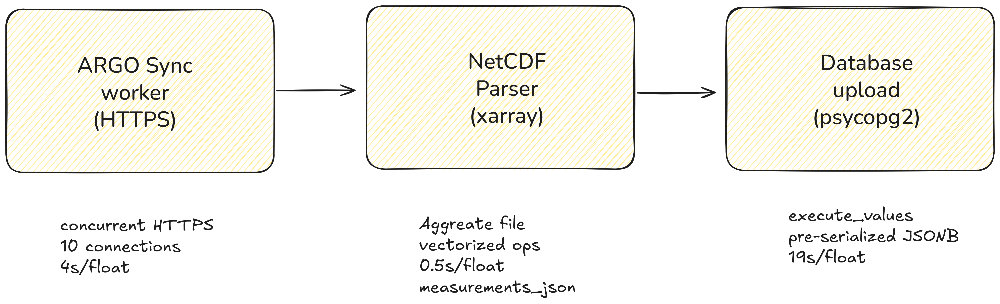

# ARGO Workers Architecture

> Technical reference for the ARGO data processing pipeline.  
> Last updated: November 2025

## Overview

The workers package downloads ARGO oceanographic float data from IFREMER, parses NetCDF files, and uploads to Neon PostgreSQL. Optimized for throughput with aggregate file parsing and batch database operations.



**End-to-end benchmark** (float 2902232, 348 profiles):

- Download: 4.0s (concurrent HTTPS)
- Parse: 0.5s
- Upload: 18.9s
- **Total: ~24s**

## Key Design Decisions

### 1. HTTPS vs FTP Protocol

IFREMER provides data via both FTP (`ftp.ifremer.fr`) and HTTPS (`data-argo.ifremer.fr`).

**Benchmark Results** (float 2902232, ~5MB total):

| Protocol               | Total Time | Speed         | Connection | Notes                    |
| ---------------------- | ---------- | ------------- | ---------- | ------------------------ |
| FTP (sequential)       | 23.4s      | 1.7 Mbps      | 2.8s       | Slow, single connection  |
| HTTPS (sequential)     | 9.0s       | 4.5 Mbps      | -          | 2.6x faster than FTP     |
| **HTTPS (concurrent)** | **4.0s**   | **10.2 Mbps** | -          | **5.8x faster than FTP** |

**Decision**: Use HTTPS with concurrent downloads. Why:

1. **Speed**: 5-6x faster than FTP with concurrent requests
2. **Reliability**: HTTP has better error handling, retries, CDN caching
3. **Firewall-friendly**: FTP passive mode often blocked in cloud environments
4. **Simpler code**: `httpx.AsyncClient` vs `ftplib` with connection management

### 2. Aggregate Files vs Individual Profiles

IFREMER provides two formats:

- **Individual**: `profiles/D{float_id}_{cycle}.nc` (one file per profile)
- **Aggregate**: `{float_id}_prof.nc` (ALL profiles in single file)

| Approach      | Files     | Parse Time | Notes                                  |
| ------------- | --------- | ---------- | -------------------------------------- |
| Individual    | 358 files | 12s        | One HTTP request per file              |
| **Aggregate** | 1 file    | **0.5s**   | Single 5MB download, xarray batch read |

**Decision**: Use aggregate files exclusively. 25x faster parsing.

### 3. JSONB Storage for Measurements

Each profile contains ~240 depth levels with temperature, salinity, oxygen, etc.

| Approach   | Rows        | Upload Time | Query Flexibility |
| ---------- | ----------- | ----------- | ----------------- |
| Normalized | 87,000 rows | 23s         | Standard SQL      |
| **JSONB**  | 359 rows    | **19s**     | JSON operators    |

**Decision**: Store measurements as pre-serialized JSONB (~28KB per profile).

Why JSONB wins:

- Row count overhead of normalized table (~87K) matches JSONB parsing cost
- JSONB enables flexible queries: `measurements->'depth_levels'->0->>'temperature'`
- Simpler schema, fewer JOINs
- Better compression (JSONB is stored binary internally)

### 4. Database Upload Method

Benchmarked approaches for 359 profiles with JSONB:

| Method             | Time   | Complexity | Notes                        |
| ------------------ | ------ | ---------- | ---------------------------- |
| **execute_values** | 19.35s | Low        | Single multi-row INSERT      |
| COPY protocol      | 18.96s | Medium     | Temp table + INSERT SELECT   |
| Apache Arrow       | 20.52s | High       | Extra serialization overhead |
| Individual INSERT  | ~60s   | Low        | N round trips                |

**Decision**: Use `psycopg2.extras.execute_values` with pre-serialized JSON.

The bottleneck is **server-side JSONB parsing** (~15s of 20s total), not client serialization or network. More complex approaches don't help because PostgreSQL must parse JSON strings into binary JSONB format regardless of transfer method.

### 5. Pre-serialized JSON

Measurements are serialized to JSON strings during parsing, not during upload:

```python
# During NetCDF parsing (0.5s phase)
profile.measurements_json = json.dumps(measurements_list)

# During upload (reuses string)
execute_values(cursor, query, [(float_id, cycle, measurements_json, ...)])
```

This moves JSON serialization into the faster parsing phase and avoids re-serializing during upload.

## Database Schema

```sql
-- Float metadata (1 row per float)
CREATE TABLE argo_float_metadata (
    float_id INTEGER PRIMARY KEY,
    wmo_number TEXT,
    float_type TEXT,
    deployment_date TIMESTAMPTZ,
    deployment_lat REAL,
    deployment_lon REAL,
    status TEXT DEFAULT 'ACTIVE'
);

-- Profiles (1 row per profile, ~350 per float)
CREATE TABLE argo_profiles (
    float_id INTEGER NOT NULL,
    cycle INTEGER NOT NULL,
    profile_time TIMESTAMPTZ,
    surface_lat REAL,
    surface_lon REAL,
    max_depth REAL,
    quality_flag TEXT,
    measurements JSONB,  -- ~28KB per row
    created_at TIMESTAMPTZ DEFAULT NOW(),
    PRIMARY KEY (float_id, cycle)
);

-- Current positions (1 row per float, updated on each upload)
CREATE TABLE argo_float_positions (
    float_id INTEGER PRIMARY KEY,
    current_lat REAL,
    current_lon REAL,
    cycle_number INTEGER,
    last_update TIMESTAMPTZ
);
```

### JSONB Measurements Structure

```json
{
  "depth_levels": [
    {
      "pressure": 5.0,
      "temperature": 28.5,
      "salinity": 34.2,
      "oxygen": 210.5,
      "qc_flags": { "temp": 1, "sal": 1, "oxy": 1 }
    }
    // ... ~240 levels per profile
  ],
  "stats": {
    "min_depth": 5.0,
    "max_depth": 2000.0,
    "surface_temp": 28.5
  }
}
```

## Performance Breakdown

### Parsing Phase (0.5s)

```python
# xarray reads all profiles at once
ds = xr.open_dataset(f"{float_id}_prof.nc")

# Vectorized extraction (no Python loops)
temperatures = ds['TEMP'].values  # (n_profiles, n_levels) array
salinities = ds['PSAL'].values
pressures = ds['PRES'].values

# Pre-serialize during extraction
for i in range(n_profiles):
    measurements_json = json.dumps(build_measurements(i, ds))
```

### Upload Phase (19s)

Timing breakdown:

- Connection setup: ~0.5s (Neon cold start avoided with transaction reuse)
- Network transfer: ~4s
- **JSONB parsing: ~15s** (server-side, unavoidable)

```python
# Single transaction for all operations
db.start_transaction()
try:
    uploader.upload_float_metadata(metadata)      # <1s
    uploader.bulk_upload_profiles(profiles)       # ~18s (JSONB bottleneck)
    uploader.upload_float_position(latest)        # <1s
    db.commit_transaction()
except:
    db.rollback_transaction()
```

## Future Optimizations

### Already Tried (No Improvement)

- **COPY protocol**: Same ~19s. JSONB parsing is server-side.
- **Apache Arrow**: Actually slower (20.5s). Extra serialization step.
- **Normalized tables**: Slower (23s). 87K rows overhead.

### Could Try

1. **Parallel uploads**: Process multiple floats concurrently (different transactions)
2. **Read replicas**: Offload queries to replicas, keep writes on primary
3. **Materialized views**: Pre-compute common aggregations
4. **Partitioning**: Partition profiles by year or float_id range

### Won't Help

- Client-side compression: Neon handles SSL compression
- Connection pooling: Single transaction pattern already optimal
- Prepared statements: execute_values already efficient

## File Reference

| File                                                  | Purpose                                    |
| ----------------------------------------------------- | ------------------------------------------ |
| `main.py`                                             | CLI entry point, argument parsing          |
| `operations.py`                                       | Orchestrates download → parse → upload     |
| `config.py`                                           | Pydantic settings, environment variables   |
| `db/connector.py`                                     | NeonDBConnector, execute_values wrapper    |
| `db/operations.py`                                    | ArgoDataUploader class                     |
| `models/argo.py`                                      | FloatMetadata, ProfileData Pydantic models |
| `workers/ftp_sync/`                                   | HTTPS download from IFREMER                |
| `workers/netcdf_processor/netcdf_parser.py`           | Parser interface                           |
| `workers/netcdf_processor/netcdf_aggregate_parser.py` | Aggregate file parsing                     |

## Benchmarks Reference

Full benchmarks from November 2025 testing:

```
Float: 2902232 (348 profiles)

Phase 1: Download
  - Aggregate files: 4 requests, 5.2MB, 5.2s
  - (Individual would be: 352 requests, 11MB, ~15s)

Phase 2: Parse
  - Aggregate parsing: 0.5s
  - (Individual would be: 12s)

Phase 3: Upload
  - execute_values: 19.35s
  - COPY protocol: 18.96s
  - Arrow + COPY: 20.52s

Total: 22s (down from ~50s with individual files)
```
