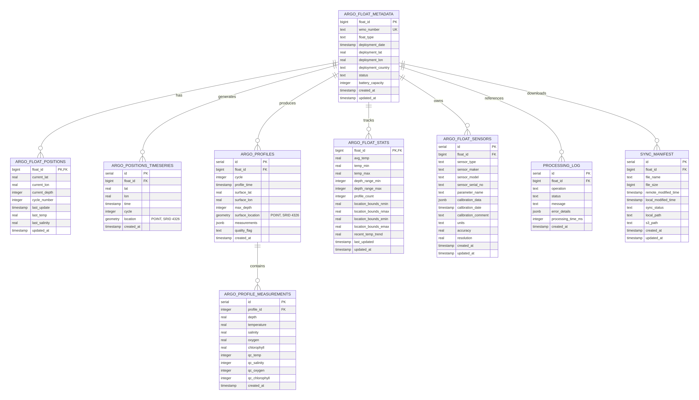

# Atlas ARGO Database Documentation

## Overview

The database uses **Neon PostgreSQL 17** with **PostGIS** for geospatial queries and follows a multi-tier storage architecture (HOT/WARM/COLD layers).

**Database Location:** Neon (Cloud)  
**Region:** AWS US-East-1  
**Extension:** PostGIS 3.4+  
**SRID:** WGS84 (EPSG:4326)

---

## Database Architecture



---

## Table Reference

### 1. **argo_float_metadata** (HOT/WARM Layer)

**Purpose:** Static float information - deployed once, rarely changes  
**Size:** ~300-400 rows (one per ARGO float)  
**Update Frequency:** Monthly (status changes only)

| Column               | Type      | Constraints      | Purpose                          |
| -------------------- | --------- | ---------------- | -------------------------------- |
| `float_id`           | BIGINT    | PRIMARY KEY      | WMO number (6-7 digits)          |
| `wmo_number`         | TEXT      | UNIQUE, NOT NULL | World standard ID                |
| `float_type`         | TEXT      |                  | Device type (ARVOR, NAVIS, etc.) |
| `deployment_date`    | TIMESTAMP |                  | When float entered ocean         |
| `deployment_lat`     | REAL      |                  | Initial latitude                 |
| `deployment_lon`     | REAL      |                  | Initial longitude                |
| `deployment_country` | TEXT      |                  | Which nation deployed it         |
| `status`             | TEXT      | DEFAULT 'ACTIVE' | Operational status               |
| `battery_capacity`   | INTEGER   |                  | Battery capacity in Ampere-hours |
| `created_at`         | TIMESTAMP | DEFAULT now()    | Record creation                  |
| `updated_at`         | TIMESTAMP | DEFAULT now()    | Last modification                |

**Indexes:**

- `argo_float_metadata_pkey` - PRIMARY KEY (float_id)
- `argo_float_metadata_wmo_idx` - BTREE (wmo_number)
- `argo_float_metadata_wmo_number_unique` - UNIQUE (wmo_number)

**Foreign Keys:**

- Referenced by: argo_float_positions, argo_positions_timeseries, argo_profiles, argo_float_stats, processing_log, sync_manifest

---

### 2. **argo_float_positions** (HOT Layer - Real-Time)

**Purpose:** Current position of each float (updated every 6 hours)  
**Size:** ~300 rows  
**Update Frequency:** Every 6 hours from FTP sync

| Column          | Type      | Constraints     | Purpose                         |
| --------------- | --------- | --------------- | ------------------------------- |
| `float_id`      | BIGINT    | PRIMARY KEY, FK | Float identifier                |
| `current_lat`   | REAL      |                 | Latest latitude                 |
| `current_lon`   | REAL      |                 | Latest longitude                |
| `current_depth` | INTEGER   |                 | Current depth in meters         |
| `cycle_number`  | INTEGER   |                 | Current mission cycle           |
| `last_update`   | TIMESTAMP |                 | When position was updated       |
| `last_temp`     | REAL      |                 | Temperature at current position |
| `last_salinity` | REAL      |                 | Salinity at current position    |
| `updated_at`    | TIMESTAMP | DEFAULT now()   | Record update time              |

**Indexes:**

- `argo_float_positions_pkey` - PRIMARY KEY (float_id)

**Foreign Keys:**

- `argo_float_positions_float_id_argo_float_metadata_float_id` - REFERENCES argo_float_metadata(float_id) ON DELETE CASCADE

**Use Cases:**

- Quick lookup: "Where is float 2902224 right now?"
- Dashboard: Show all current positions on map
- Cache: Redis clones this table for <50ms response times

---

### 3. **argo_positions_timeseries** (WARM Layer - Last 6 Months)

**Purpose:** Historical position tracking with geospatial indexing  
**Size:** ~95,700 positions (300 floats × ~319 profiles × 10-day cycles)  
**Update Frequency:** Every 6 hours (incremental append)

| Column       | Type                  | Constraints   | Purpose                       |
| ------------ | --------------------- | ------------- | ----------------------------- |
| `id`         | SERIAL                | PRIMARY KEY   | Auto-increment row ID         |
| `float_id`   | BIGINT                | NOT NULL, FK  | Float reference               |
| `lat`        | REAL                  | NOT NULL      | Position latitude             |
| `lon`        | REAL                  | NOT NULL      | Position longitude            |
| `time`       | TIMESTAMP             | NOT NULL      | Position timestamp            |
| `cycle`      | INTEGER               |               | Mission cycle number          |
| `location`   | GEOMETRY(POINT, 4326) |               | Spatial point for GIS queries |
| `created_at` | TIMESTAMP             | DEFAULT now() | Record insertion time         |

**Indexes:**

- `argo_positions_timeseries_pkey` - PRIMARY KEY (id)
- `positions_time_idx` - BTREE (float_id, time) - **Performance index**
- `positions_time_only_idx` - BTREE (time)
- `positions_spatial_idx` - GIST (location) - **Spatial index for map queries**

**Foreign Keys:**

- `argo_positions_timeseries_float_id_argo_float_metadata_float_id` - REFERENCES argo_float_metadata(float_id) ON DELETE CASCADE

**Use Cases:**

- Trajectory visualization: "Show me where float X was between date1 and date2"
- Spatial queries: "Find all floats within 500km of coordinates"
- Analytics: "Calculate average position per 10-day cycle"

**Storage Strategy:**

- WARM layer (6 months of data): Kept in PostgreSQL
- COLD layer (historical): Archived to MinIO S3 as Parquet files

---

### 4. **argo_profiles** (WARM Layer - Last 6 Months)

**Purpose:** Profile measurements (temperature, salinity, oxygen, chlorophyll)  
**Size:** ~95,700 profiles (300 floats × ~319 profiles each)  
**Update Frequency:** Every 6 hours (one profile per float per cycle)

| Column             | Type                  | Constraints         | Purpose                               |
| ------------------ | --------------------- | ------------------- | ------------------------------------- |
| `id`               | SERIAL                | PRIMARY KEY         | Auto-increment profile ID             |
| `float_id`         | BIGINT                | NOT NULL, FK        | Float reference                       |
| `cycle`            | INTEGER               | NOT NULL            | Profile cycle number                  |
| `profile_time`     | TIMESTAMP             | NOT NULL            | When profile was taken                |
| `surface_lat`      | REAL                  |                     | Latitude at surface                   |
| `surface_lon`      | REAL                  |                     | Longitude at surface                  |
| `max_depth`        | INTEGER               |                     | Deepest measurement (meters)          |
| `surface_location` | GEOMETRY(POINT, 4326) |                     | Surface point (WGS84)                 |
| `measurements`     | JSONB                 | DEFAULT '{}'        | Sensor data arrays                    |
| `quality_flag`     | TEXT                  | DEFAULT 'REAL_TIME' | Data quality (REAL_TIME/DELAYED_MODE) |
| `created_at`       | TIMESTAMP             | DEFAULT now()       | Record insertion time                 |

**Indexes:**

- `argo_profiles_pkey` - PRIMARY KEY (id)
- `profiles_float_time_idx` - BTREE (float_id, profile_time) - **Performance index**
- `profiles_time_idx` - BTREE (profile_time)
- `profiles_qc_idx` - BTREE (quality_flag)
- `profiles_spatial_idx` - GIST (surface_location) - **Spatial index**

**Foreign Keys:**

- `argo_profiles_float_id_argo_float_metadata_float_id` - REFERENCES argo_float_metadata(float_id) ON DELETE CASCADE

**JSONB Measurements Structure:**

```json
{
  "TEMP": [20.5, 19.8, 18.2, 15.1, 10.3, 5.2, 2.1],
  "PSAL": [34.5, 34.6, 34.7, 34.9, 35.0, 34.8, 34.7],
  "DOXY": [200, 190, 180, 150, 100, 50, 30],
  "CHLA": [0.8, 0.9, 1.0, 0.7, 0.5, 0.3, 0.2],
  "depths": [0, 5, 10, 20, 50, 100, 200],
  "vertical_sampling_scheme": "PRIMARY",
  "c_profile_type": 800
}
```

**Use Cases:**

- Profile graph: "Show temperature/salinity/oxygen for float X at time Y"
- Analytics: "Compare profiles across all floats in region Z"
- Machine learning: "Train models on historical profile patterns"

---

### 5. **argo_float_stats** (WARM Layer - Cached)

**Purpose:** Pre-calculated aggregates for dashboard performance  
**Size:** ~300 rows (one per active float)  
**Update Frequency:** Hourly (cache warmer job)

| Column                 | Type      | Constraints     | Purpose                                |
| ---------------------- | --------- | --------------- | -------------------------------------- |
| `float_id`             | BIGINT    | PRIMARY KEY, FK | Float reference                        |
| `avg_temp`             | REAL      |                 | Average temperature (all profiles)     |
| `temp_min`             | REAL      |                 | Minimum recorded temperature           |
| `temp_max`             | REAL      |                 | Maximum recorded temperature           |
| `depth_range_min`      | INTEGER   |                 | Shallowest measurement depth           |
| `depth_range_max`      | INTEGER   |                 | Deepest measurement depth              |
| `profile_count`        | INTEGER   | DEFAULT 0       | Total profiles collected               |
| `location_bounds_nmin` | REAL      |                 | South boundary (min latitude)          |
| `location_bounds_nmax` | REAL      |                 | North boundary (max latitude)          |
| `location_bounds_emin` | REAL      |                 | West boundary (min longitude)          |
| `location_bounds_emax` | REAL      |                 | East boundary (max longitude)          |
| `recent_temp_trend`    | REAL      |                 | Temperature change (now vs 7 days ago) |
| `last_updated`         | TIMESTAMP |                 | When stats were calculated             |
| `updated_at`           | TIMESTAMP | DEFAULT now()   | Cache timestamp                        |

**Indexes:**

- `argo_float_stats_pkey` - PRIMARY KEY (float_id)

**Foreign Keys:**

- `argo_float_stats_float_id_argo_float_metadata_float_id` - REFERENCES argo_float_metadata(float_id) ON DELETE CASCADE

**Use Cases:**

- Dashboard stats: "Show min/max temperature for float X"
- Bounding boxes: "Get spatial extent of float's trajectory"
- Trends: "Is temperature increasing or decreasing?"

---

### 6. **argo_profile_measurements** (WARM Layer - Normalized Profiles)

**Purpose:** Normalized vertical profile measurements at each depth level  
**Size:** ~2-3M rows (95,700 profiles × 20-40 measurements per profile)  
**Update Frequency:** Every 6 hours (grows with new profiles)

| Column           | Type      | Constraints   | Purpose                              |
| ---------------- | --------- | ------------- | ------------------------------------ |
| `id`             | SERIAL    | PRIMARY KEY   | Auto-increment measurement ID        |
| `profile_id`     | INTEGER   | NOT NULL, FK  | Profile reference                    |
| `depth`          | REAL      | NOT NULL      | Measurement depth in meters          |
| `temperature`    | REAL      |               | Temperature value (°C)               |
| `salinity`       | REAL      |               | Salinity value (PSU)                 |
| `oxygen`         | REAL      |               | Dissolved oxygen (µmol/kg)           |
| `chlorophyll`    | REAL      |               | Chlorophyll concentration (mg/m³)    |
| `qc_temp`        | INTEGER   |               | Temperature QC flag (0-9 ARGO scale) |
| `qc_salinity`    | INTEGER   |               | Salinity QC flag                     |
| `qc_oxygen`      | INTEGER   |               | Oxygen QC flag                       |
| `qc_chlorophyll` | INTEGER   |               | Chlorophyll QC flag                  |
| `created_at`     | TIMESTAMP | DEFAULT now() | Record insertion time                |

**Indexes:**

- `argo_profile_measurements_pkey` - PRIMARY KEY (id)
- `profile_measurements_profile_depth_idx` - BTREE (profile_id, depth) - **Composite for fast vertical profile lookup**
- `profile_measurements_depth_idx` - BTREE (depth) - **Global depth queries**
- `profile_measurements_temp_idx` - BTREE (temperature) - **Temperature analysis**

**Foreign Keys:**

- `argo_profile_measurements_profile_id_argo_profiles_id_fk` - REFERENCES argo_profiles(id) ON DELETE CASCADE

**QC Flag Values (ARGO Standard):**

- `0` = Good data
- `1` = Probably good data
- `2` = Probably bad data
- `3` = Bad data
- `4` = Changed
- `5` = Not used
- `8` = Estimated
- `9` = Missing value

**Use Cases:**

- Vertical profiles: "Show temperature profile for float X at cycle Y"
- QC filtering: "Only include measurements with QC flag ≤ 1"
- Depth analysis: "Find all measurements at 1000m depth"
- Parameter correlations: "Compare temperature vs salinity trends"

---

### 7. **argo_float_sensors** (WARM Layer - Sensor Metadata)

**Purpose:** Sensor configuration and calibration data for each float  
**Size:** ~2-5K rows (300 floats × 5-15 sensors each)  
**Update Frequency:** Monthly (sensor configuration rarely changes)

| Column                | Type      | Constraints   | Purpose                                        |
| --------------------- | --------- | ------------- | ---------------------------------------------- |
| `id`                  | SERIAL    | PRIMARY KEY   | Auto-increment sensor record ID                |
| `float_id`            | BIGINT    | NOT NULL, FK  | Float reference                                |
| `sensor_type`         | TEXT      | NOT NULL      | Sensor category (CTD, OPTODE, etc)             |
| `sensor_maker`        | TEXT      |               | Manufacturer name                              |
| `sensor_model`        | TEXT      |               | Model number or name                           |
| `sensor_serial_no`    | TEXT      |               | Serial number for traceability                 |
| `parameter_name`      | TEXT      |               | What parameter it measures (TEMP/PSAL/DOXY)    |
| `calibration_data`    | JSONB     |               | Calibration coefficients and equations         |
| `calibration_date`    | TIMESTAMP |               | When calibration was performed                 |
| `calibration_comment` | TEXT      |               | Calibration notes/reference                    |
| `units`               | TEXT      |               | Measurement units                              |
| `accuracy`            | REAL      |               | Sensor accuracy specification                  |
| `resolution`          | REAL      |               | Sensor resolution (smallest detectable change) |
| `created_at`          | TIMESTAMP | DEFAULT now() | Record insertion time                          |
| `updated_at`          | TIMESTAMP | DEFAULT now() | Last modification time                         |

**Indexes:**

- `argo_float_sensors_pkey` - PRIMARY KEY (id)
- `float_sensors_float_sensor_idx` - BTREE (float_id, sensor_type) - **Find all sensors of type on float**
- `float_sensors_parameter_idx` - BTREE (parameter_name) - **Find all sensors measuring parameter**

**Foreign Keys:**

- `argo_float_sensors_float_id_argo_float_metadata_float_id_fk` - REFERENCES argo_float_metadata(float_id) ON DELETE CASCADE

**Calibration Data Structure (Example):**

```json
{
  "calibration_equation": "TEMP_calib = G0 + G1 * freq_sample",
  "coefficients": {
    "G0": 24.5,
    "G1": -0.045
  },
  "reference_document": "SBE_CTD_Sensor_Manual_v7.26",
  "pre_calibration_offset": 0.02,
  "post_calibration_offset": -0.01
}
```

**Use Cases:**

- Sensor validation: "What sensors are on float 2902224?"
- Calibration tracking: "When was the CTD on float X last calibrated?"
- Data correction: "Apply calibration coefficients to measurements"
- Quality control: "Check if temperature measurements are within sensor accuracy"

**Sample Query - Apply Calibration:**

```sql
SELECT
    m.depth,
    m.temperature as raw_temp,
    m.temperature +
      (s.calibration_data->>'pre_calibration_offset')::float as corrected_temp
FROM argo_profile_measurements m
JOIN argo_profiles p ON m.profile_id = p.id
JOIN argo_float_sensors s ON p.float_id = s.float_id
WHERE p.float_id = 2902224
  AND s.parameter_name = 'TEMP'
  AND m.qc_temp <= 1;  -- Only good quality data
```

---

### 8. **processing_log** (DEBUG/Audit)

**Purpose:** Track all worker operations for debugging and monitoring  
**Size:** ~1-5K rows (depends on operation volume)  
**Update Frequency:** Continuous (every worker operation)

| Column               | Type      | Constraints   | Purpose                                |
| -------------------- | --------- | ------------- | -------------------------------------- |
| `id`                 | SERIAL    | PRIMARY KEY   | Log entry ID                           |
| `float_id`           | BIGINT    | FK (optional) | Associated float (null for global ops) |
| `operation`          | TEXT      |               | Operation type                         |
| `status`             | TEXT      |               | SUCCESS, ERROR, PENDING, RETRY         |
| `message`            | TEXT      |               | Human-readable message                 |
| `error_details`      | JSONB     |               | Stack trace or error context           |
| `processing_time_ms` | INTEGER   |               | Duration in milliseconds               |
| `created_at`         | TIMESTAMP | DEFAULT now() | Timestamp                              |

**Operation Types:**

- `FTP_DOWNLOAD` - NetCDF file downloaded from IFREMER
- `PARSE_NETCDF` - File converted to database records
- `INSERT_PROFILES` - Profiles inserted to PostgreSQL
- `REDIS_CACHE` - Data cached to Redis
- `S3_ARCHIVE` - Data archived to MinIO
- `STATS_UPDATE` - Aggregates recalculated

**Indexes:**

- `processing_log_pkey` - PRIMARY KEY (id)
- `log_float_op_idx` - BTREE (float_id, operation)
- `log_time_idx` - BTREE (created_at)

**Use Cases:**

- Debugging: "Why did float X's sync fail?"
- Monitoring: "How many operations succeeded in the last hour?"
- Performance: "Which operations take longest?"

---

### 9. **sync_manifest** (Operational)

**Purpose:** Track downloaded files to enable incremental syncing  
**Size:** ~300-1K rows (grows as files are synced)  
**Update Frequency:** Every sync cycle (6 hours)

| Column                 | Type      | Constraints      | Purpose                        |
| ---------------------- | --------- | ---------------- | ------------------------------ |
| `id`                   | SERIAL    | PRIMARY KEY      | Manifest entry ID              |
| `float_id`             | BIGINT    | FK (optional)    | Associated float               |
| `file_name`            | TEXT      | NOT NULL         | Remote filename                |
| `file_size`            | BIGINT    |                  | File size in bytes             |
| `remote_modified_time` | TIMESTAMP |                  | FTP file modification time     |
| `local_modified_time`  | TIMESTAMP |                  | Local disk file mtime          |
| `sync_status`          | TEXT      | DEFAULT 'SYNCED' | SYNCED, PENDING, FAILED, RETRY |
| `local_path`           | TEXT      |                  | Local filesystem path          |
| `s3_path`              | TEXT      |                  | MinIO S3 URI                   |
| `created_at`           | TIMESTAMP | DEFAULT now()    | First sync attempt             |
| `updated_at`           | TIMESTAMP | DEFAULT now()    | Last sync attempt              |

**Indexes:**

- `sync_manifest_pkey` - PRIMARY KEY (id)
- `manifest_float_file_idx` - BTREE (float_id, file_name)
- `manifest_status_idx` - BTREE (sync_status)

**Use Cases:**

- Incremental sync: "Which files need downloading since last sync?"
- Retry logic: "Retry all FAILED syncs"
- Monitoring: "What's the sync success rate?"

---

## SQL Query Examples

### Example 1: Current Positions of All Active Floats

```sql
-- Dashboard: Show all float positions on map (Tough this fn will load form redis)
SELECT
    m.float_id,
    m.wmo_number,
    p.current_lat,
    p.current_lon,
    p.current_depth,
    p.last_temp,
    p.last_update,
    m.status
FROM argo_float_positions p
JOIN argo_float_metadata m ON p.float_id = m.float_id
WHERE m.status = 'ACTIVE'
  AND p.last_update > NOW() - INTERVAL '24 hours'
ORDER BY p.last_update DESC;
```

**Response Time:** <50ms (HOT layer, single table join)  
**Use Case:** Initial dashboard load showing all active floats

---

### Example 2: Float Trajectory Over Time Period

```sql
-- Detail panel: Show where float 2902224 traveled between two dates
SELECT
    float_id,
    lat,
    lon,
    time,
    cycle,
    ST_AsGeoJSON(location) as geom_json
FROM argo_positions_timeseries
WHERE float_id = 2902224
  AND time BETWEEN '2025-09-01' AND '2025-11-06'
ORDER BY time ASC;
```

**Response Time:** <100ms (WARM layer, spatial index on time range)  
**Use Case:** Trajectory visualization on map

---

### Example 3: Spatial Query - Floats Near a Location

```sql
-- Find all floats within 500km of Indian coast (72°E, 12°N)
SELECT
    m.float_id,
    m.wmo_number,
    p.lat,
    p.lon,
    ST_Distance(
        ST_MakePoint(72, 12)::geography,
        ST_MakePoint(p.lon, p.lat)::geography
    ) / 1000 as distance_km
FROM argo_positions_timeseries p
JOIN argo_float_metadata m ON p.float_id = m.float_id
WHERE ST_DWithin(
    ST_MakePoint(p.lon, p.lat)::geography,
    ST_MakePoint(72, 12)::geography,
    500000  -- 500km in meters
)
  AND p.time > NOW() - INTERVAL '7 days'
ORDER BY distance_km ASC;
```

**Response Time:** <200ms (spatial index lookup)  
**Use Case:** Find floats in specific ocean region

---

### Example 4: Profile Data for a Specific Float & Cycle

```sql
-- Vertical profile: Show temperature and salinity for float 2902224, cycle 150
SELECT
    id,
    cycle,
    profile_time,
    surface_lat,
    surface_lon,
    max_depth,
    measurements->>'TEMP' as temp_profile,
    measurements->>'PSAL' as salinity_profile,
    measurements->>'DOXY' as oxygen_profile,
    measurements->>'depths' as depth_levels,
    quality_flag
FROM argo_profiles
WHERE float_id = 2902224
  AND cycle = 150
LIMIT 1;
```

**Response Time:** <50ms (BTREE index on float_id, cycle)  
**Use Case:** Display vertical profile graph

---

### Example 5: Temperature Trends Over 6 Months

```sql
-- Analytics: Average temperature per float over time
SELECT
    float_id,
    DATE_TRUNC('week', profile_time) as week,
    AVG(CAST(measurements->>'TEMP' as REAL)) as avg_temp,
    MIN(CAST(measurements->>'TEMP' as REAL)) as min_temp,
    MAX(CAST(measurements->>'TEMP' as REAL)) as max_temp,
    COUNT(*) as profile_count
FROM argo_profiles
WHERE profile_time > NOW() - INTERVAL '6 months'
  AND measurements->>'TEMP' IS NOT NULL
GROUP BY float_id, DATE_TRUNC('week', profile_time)
ORDER BY float_id, week DESC;
```

**Response Time:** <2s (batch query, aggregation)  
**Use Case:** Historical trends analysis

---

### Example 6: Floats with Temperature Anomalies

```sql
-- Anomaly detection: Find floats with unusual temperature readings
SELECT
    p.id,
    p.float_id,
    p.profile_time,
    CAST(p.measurements->>'TEMP' as REAL) as temp,
    s.avg_temp,
    s.temp_max,
    CAST(p.measurements->>'TEMP' as REAL) - s.avg_temp as deviation
FROM argo_profiles p
JOIN argo_float_stats s ON p.float_id = s.float_id
WHERE CAST(p.measurements->>'TEMP' as REAL) > s.temp_max * 1.1
   OR CAST(p.measurements->>'TEMP' as REAL) < s.temp_min * 0.9
ORDER BY ABS(deviation) DESC
LIMIT 20;
```

**Response Time:** <500ms (profile scan with stats join)  
**Use Case:** Detect sensor malfunctions or unusual oceanographic events

---

### Example 7: Sync Status & Debugging

```sql
-- Operations: Show all failed syncs in the last 24 hours
SELECT
    l.id,
    l.float_id,
    l.operation,
    l.status,
    l.message,
    l.error_details,
    l.processing_time_ms,
    l.created_at
FROM processing_log l
WHERE l.status = 'ERROR'
  AND l.created_at > NOW() - INTERVAL '24 hours'
ORDER BY l.created_at DESC;
```

**Response Time:** <100ms (index on status and created_at)  
**Use Case:** Monitor system health

---

### Example 8: Files Pending Sync

```sql
-- Maintenance: Retry all pending file syncs
SELECT
    id,
    float_id,
    file_name,
    file_size,
    local_path,
    sync_status,
    updated_at
FROM sync_manifest
WHERE sync_status IN ('PENDING', 'FAILED')
  AND updated_at < NOW() - INTERVAL '1 hour'
ORDER BY updated_at ASC
LIMIT 50;
```

**Response Time:** <50ms (index on sync_status)  
**Use Case:** Retry failed downloads

---

### Example 9: Bounding Box Queries (Map Zoom)

```sql
-- Map rendering: Get all float positions in a bounding box
SELECT
    p.float_id,
    p.lat,
    p.lon,
    p.last_temp,
    p.last_update,
    ST_AsGeoJSON(ST_MakePoint(p.lon, p.lat)) as geom
FROM argo_float_positions p
WHERE p.lon BETWEEN 70 AND 75
  AND p.lat BETWEEN 10 AND 15
  AND p.last_update > NOW() - INTERVAL '48 hours';
```

**Response Time:** <100ms (spatial bounds query)  
**Use Case:** Efficient map tile rendering

---

### Example 10: Statistics Cache Refresh

```sql
-- Cache warmer: Recalculate float statistics
UPDATE argo_float_stats s
SET
    avg_temp = (
        SELECT AVG(CAST(measurements->>'TEMP' as REAL))
        FROM argo_profiles p
        WHERE p.float_id = s.float_id
          AND p.profile_time > NOW() - INTERVAL '6 months'
    ),
    temp_min = (
        SELECT MIN(CAST(measurements->>'TEMP' as REAL))
        FROM argo_profiles p
        WHERE p.float_id = s.float_id
          AND p.profile_time > NOW() - INTERVAL '6 months'
    ),
    temp_max = (
        SELECT MAX(CAST(measurements->>'TEMP' as REAL))
        FROM argo_profiles p
        WHERE p.float_id = s.float_id
          AND p.profile_time > NOW() - INTERVAL '6 months'
    ),
    profile_count = (
        SELECT COUNT(*)
        FROM argo_profiles p
        WHERE p.float_id = s.float_id
          AND p.profile_time > NOW() - INTERVAL '6 months'
    ),
    last_updated = NOW(),
    updated_at = NOW()
WHERE s.float_id IN (
    SELECT DISTINCT float_id FROM argo_profiles
    WHERE profile_time > NOW() - INTERVAL '1 hour'
);
```

**Response Time:** <5s (bulk update with subqueries)  
**Use Case:** Hourly cache refresh job

---

## Performance Optimization

### Key Indexes

| Table                       | Index                     | Type  | Purpose                  |
| --------------------------- | ------------------------- | ----- | ------------------------ |
| `argo_float_positions`      | `pkey`                    | BTREE | Primary lookup           |
| `argo_positions_timeseries` | `positions_time_idx`      | BTREE | Time range queries       |
| `argo_positions_timeseries` | `positions_spatial_idx`   | GIST  | Geographic queries       |
| `argo_profiles`             | `profiles_float_time_idx` | BTREE | Profile lookups          |
| `argo_profiles`             | `profiles_spatial_idx`    | GIST  | Surface location queries |
| `argo_profiles`             | `profiles_qc_idx`         | BTREE | Quality filtering        |
| `processing_log`            | `log_float_op_idx`        | BTREE | Debug queries            |
| `processing_log`            | `log_time_idx`            | BTREE | Time-based queries       |
| `sync_manifest`             | `manifest_float_file_idx` | BTREE | Incremental sync         |
| `sync_manifest`             | `manifest_status_idx`     | BTREE | Retry operations         |

---

## Data Integrity

### Foreign Key Relationships

All child tables enforce referential integrity through cascade delete:

```sql
-- When a float is deleted/retired, cascade to all child records
ALTER TABLE argo_float_positions
  ADD CONSTRAINT fk_float_positions
  FOREIGN KEY (float_id)
  REFERENCES argo_float_metadata(float_id)
  ON DELETE CASCADE;

-- Maintains data consistency across all related records
```

### Unique Constraints

| Table                       | Column(s)    | Purpose                                 |
| --------------------------- | ------------ | --------------------------------------- |
| `argo_float_metadata`       | `wmo_number` | Ensure one float per WMO ID             |
| `argo_positions_timeseries` | (composite)  | Natural uniqueness via float_id + time  |
| `argo_profiles`             | (composite)  | Natural uniqueness via float_id + cycle |

---

## Multi-Tier Storage Strategy


## Worker Operations

### Worker #1: FTP Sync (Every 6 hours)

1. Query `sync_manifest` for last sync time
2. Connect to `data-argo.ifremer.fr` FTP
3. Download new NetCDF files (incremental)
4. Update `sync_manifest` table
5. Log operations to `processing_log`

### Worker #2: NetCDF Parser (Every 6 hours)

1. Read downloaded NetCDF files
2. Parse positions → `argo_positions_timeseries`
3. Parse profiles → `argo_profiles`
4. Update `argo_float_positions` (HOT layer)
5. Archive to MinIO S3 (COLD layer)
6. Log to `processing_log`

### Worker #3: Cache Warmer (Hourly)

1. Recalculate aggregates from profiles
2. Update `argo_float_stats`
3. Clone to Redis (HOT layer)
4. Update bounding boxes

## Setup & Maintenance

```bash
cd packages/db
bun install
infisical run --env=dev bun run db:generate  # Create migrations
infisical run --env=dev bun run db:push       # Apply to Neon
```

## Support

For questions about database structure, index design, or query optimization, refer to:

- **Schema File:** `src/schema.ts` (Drizzle ORM definitions)
- **Migrations:** `src/migrations/` (Applied changes)
- **Neon Console:** [neon.tech/app/projects/late-recipe-96880584](https://neon.tech)

---

**Last Updated:** November 7, 2025  
**Singed By** @Itz-Agasta
