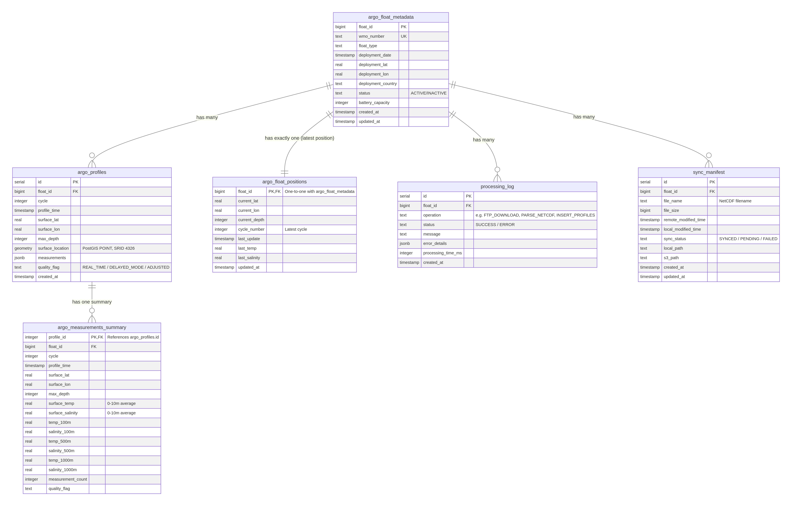
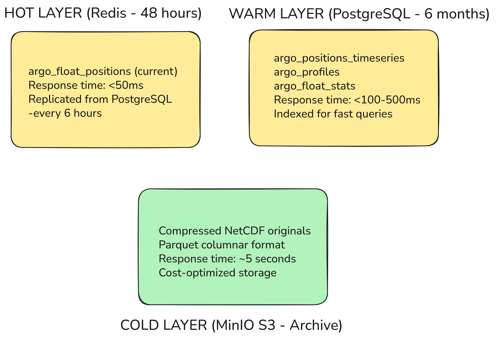

# Atlas ARGO Database Documentation

## Overview

The database uses **Neon PostgreSQL 17** with **PostGIS** for geospatial queries and follows a multi-tier storage architecture (HOT/WARM/COLD layers).

**Database Location:** Neon (Cloud)  
**Region:** AWS US-East-1  
**Extension:** PostGIS 3.4+  
**SRID:** WGS84 (EPSG:4326)

---

## Database Architecture



---

## Table Reference

### 1. **argo_float_metadata** (HOT/WARM Layer)

**Purpose:** Static float information - deployed once, rarely changes  
**Size:** ~300-400 rows (one per ARGO float)  
**Update Frequency:** Monthly (status changes only)

| Column               | Type      | Constraints      | Purpose                          |
| -------------------- | --------- | ---------------- | -------------------------------- |
| `float_id`           | BIGINT    | PRIMARY KEY      | WMO number (6-7 digits)          |
| `wmo_number`         | TEXT      | UNIQUE, NOT NULL | World standard ID                |
| `float_type`         | TEXT      |                  | Device type (ARVOR, NAVIS, etc.) |
| `deployment_date`    | TIMESTAMP |                  | When float entered ocean         |
| `deployment_lat`     | REAL      |                  | Initial latitude                 |
| `deployment_lon`     | REAL      |                  | Initial longitude                |
| `deployment_country` | TEXT      |                  | Which nation deployed it         |
| `status`             | TEXT      | DEFAULT 'ACTIVE' | Operational status               |
| `battery_capacity`   | INTEGER   |                  | Battery capacity in Ampere-hours |
| `created_at`         | TIMESTAMP | DEFAULT now()    | Record creation                  |
| `updated_at`         | TIMESTAMP | DEFAULT now()    | Last modification                |

**Indexes:**

- `argo_float_metadata_pkey` - PRIMARY KEY (float_id)
- `argo_float_metadata_wmo_idx` - BTREE (wmo_number)

**Foreign Keys:**

- Referenced by: argo_float_positions, argo_profiles, processing_log, sync_manifest

---

### 2. **argo_float_positions** (HOT Layer - Real-Time)

**Purpose:** Current position of each float (updated every 6 hours)  
**Size:** ~300 rows  
**Update Frequency:** Every 6 hours from FTP sync

| Column          | Type      | Constraints     | Purpose                         |
| --------------- | --------- | --------------- | ------------------------------- |
| `float_id`      | BIGINT    | PRIMARY KEY, FK | Float identifier                |
| `current_lat`   | REAL      |                 | Latest latitude                 |
| `current_lon`   | REAL      |                 | Latest longitude                |
| `current_depth` | INTEGER   |                 | Current depth in meters         |
| `cycle_number`  | INTEGER   |                 | Current mission cycle           |
| `last_update`   | TIMESTAMP |                 | When position was updated       |
| `last_temp`     | REAL      |                 | Temperature at current position |
| `last_salinity` | REAL      |                 | Salinity at current position    |
| `updated_at`    | TIMESTAMP | DEFAULT now()   | Record update time              |

**Indexes:**

- `argo_float_positions_pkey` - PRIMARY KEY (float_id)

**Foreign Keys:**

- `argo_float_positions_float_id_argo_float_metadata_float_id` - REFERENCES argo_float_metadata(float_id) ON DELETE CASCADE

**Use Cases:**

- Quick lookup: "Where is float 2902224 right now?"
- Dashboard: Show all current positions on map
- Cache: Redis clones this table for <50ms response times

---

### 3. **argo_profiles** (WARM Layer - Last 6 Months)

**Purpose:** Profile measurements (temperature, salinity, oxygen, chlorophyll)  
**Size:** ~95,700 profiles (300 floats × ~319 profiles each)  
**Update Frequency:** Every 6 hours (one profile per float per cycle)

| Column             | Type                  | Constraints         | Purpose                               |
| ------------------ | --------------------- | ------------------- | ------------------------------------- |
| `id`               | SERIAL                | PRIMARY KEY         | Auto-increment profile ID             |
| `float_id`         | BIGINT                | NOT NULL, FK        | Float reference                       |
| `cycle`            | INTEGER               | NOT NULL            | Profile cycle number                  |
| `profile_time`     | TIMESTAMP             | NOT NULL            | When profile was taken                |
| `surface_lat`      | REAL                  |                     | Latitude at surface                   |
| `surface_lon`      | REAL                  |                     | Longitude at surface                  |
| `max_depth`        | INTEGER               |                     | Deepest measurement (meters)          |
| `surface_location` | GEOMETRY(POINT, 4326) |                     | Surface point (WGS84)                 |
| `measurements`     | JSONB                 | DEFAULT '{}'        | Sensor data arrays                    |
| `quality_flag`     | TEXT                  | DEFAULT 'REAL_TIME' | Data quality (REAL_TIME/DELAYED_MODE) |
| `created_at`       | TIMESTAMP             | DEFAULT now()       | Record insertion time                 |

**Indexes:**

- `argo_profiles_pkey` - PRIMARY KEY (id)
- `profiles_float_time_idx` - BTREE (float_id, profile_time)
- `profiles_time_idx` - BTREE (profile_time)
- `profiles_qc_idx` - BTREE (quality_flag)
- `profiles_spatial_idx` - GIST (surface_location)
- `profiles_measurements_gin_idx` - GIN (measurements)
- `profiles_float_cycle_unique` - UNIQUE (float_id, cycle)

**Foreign Keys:**

- `argo_profiles_float_id_argo_float_metadata_float_id` - REFERENCES argo_float_metadata(float_id) ON DELETE CASCADE

**JSONB Measurements Structure:**

```json
{
  "TEMP": [20.5, 19.8, 18.2, 15.1, 10.3, 5.2, 2.1],
  "PSAL": [34.5, 34.6, 34.7, 34.9, 35.0, 34.8, 34.7],
  "DOXY": [200, 190, 180, 150, 100, 50, 30],
  "CHLA": [0.8, 0.9, 1.0, 0.7, 0.5, 0.3, 0.2],
  "depths": [0, 5, 10, 20, 50, 100, 200]
}
```

**Use Cases:**

- Profile graph: "Show temperature/salinity/oxygen for float X at time Y"
- Analytics: "Compare profiles across all floats in region Z"
- Machine learning: "Train models on historical profile patterns"

---

### 4. **processing_log** (DEBUG/Audit)

**Purpose:** Track all worker operations for debugging and monitoring  
**Size:** ~1-5K rows (depends on operation volume)  
**Update Frequency:** Continuous (every worker operation)

| Column               | Type      | Constraints   | Purpose                                |
| -------------------- | --------- | ------------- | -------------------------------------- |
| `id`                 | SERIAL    | PRIMARY KEY   | Log entry ID                           |
| `float_id`           | BIGINT    | FK (optional) | Associated float (null for global ops) |
| `operation`          | TEXT      |               | Operation type                         |
| `status`             | TEXT      |               | SUCCESS, ERROR, PENDING, RETRY         |
| `message`            | TEXT      |               | Human-readable message                 |
| `error_details`      | JSONB     |               | Stack trace or error context           |
| `processing_time_ms` | INTEGER   |               | Duration in milliseconds               |
| `created_at`         | TIMESTAMP | DEFAULT now() | Timestamp                              |

**Operation Types:**

- `FTP_DOWNLOAD` - NetCDF file downloaded from IFREMER
- `PARSE_NETCDF` - File converted to database records
- `INSERT_PROFILES` - Profiles inserted to PostgreSQL
- `REDIS_CACHE` - Data cached to Redis
- `S3_ARCHIVE` - Data archived to MinIO
- `STATS_UPDATE` - Aggregates recalculated

**Indexes:**

- `processing_log_pkey` - PRIMARY KEY (id)
- `log_float_op_idx` - BTREE (float_id, operation)
- `log_time_idx` - BTREE (created_at)

**Use Cases:**

- Debugging: "Why did float X's sync fail?"
- Monitoring: "How many operations succeeded in the last hour?"
- Performance: "Which operations take longest?"

---

### 5. **sync_manifest** (Operational)

**Purpose:** Track downloaded files to enable incremental syncing  
**Size:** ~300-1K rows (grows as files are synced)  
**Update Frequency:** Every sync cycle (6 hours)

| Column                 | Type      | Constraints      | Purpose                        |
| ---------------------- | --------- | ---------------- | ------------------------------ |
| `id`                   | SERIAL    | PRIMARY KEY      | Manifest entry ID              |
| `float_id`             | BIGINT    | FK (optional)    | Associated float               |
| `file_name`            | TEXT      | NOT NULL         | Remote filename                |
| `file_size`            | BIGINT    |                  | File size in bytes             |
| `remote_modified_time` | TIMESTAMP |                  | FTP file modification time     |
| `local_modified_time`  | TIMESTAMP |                  | Local disk file mtime          |
| `sync_status`          | TEXT      | DEFAULT 'SYNCED' | SYNCED, PENDING, FAILED, RETRY |
| `local_path`           | TEXT      |                  | Local filesystem path          |
| `s3_path`              | TEXT      |                  | MinIO S3 URI                   |
| `created_at`           | TIMESTAMP | DEFAULT now()    | First sync attempt             |
| `updated_at`           | TIMESTAMP | DEFAULT now()    | Last sync attempt              |

**Indexes:**

- `sync_manifest_pkey` - PRIMARY KEY (id)
- `manifest_float_file_idx` - BTREE (float_id, file_name)
- `manifest_status_idx` - BTREE (sync_status)

**Use Cases:**

- Incremental sync: "Which files need downloading since last sync?"
- Retry logic: "Retry all FAILED syncs"
- Monitoring: "What's the sync success rate?"

---

### 6. **argo_measurements_summary** (Materialized View - Pre-computed)

**Purpose:** Pre-computed measurements at standard depths for fast dashboard queries  
**Refresh:** Manual or scheduled (depends on data updates)

| Column              | Type      | Purpose                               |
| ------------------- | --------- | ------------------------------------- |
| `profile_id`        | INTEGER   | Profile ID reference                  |
| `float_id`          | BIGINT    | Float reference                       |
| `cycle`             | INTEGER   | Profile cycle number                  |
| `profile_time`      | TIMESTAMP | When profile was taken                |
| `surface_lat`       | REAL      | Latitude at surface                   |
| `surface_lon`       | REAL      | Longitude at surface                  |
| `max_depth`         | INTEGER   | Deepest measurement (meters)          |
| `surface_temp`      | REAL      | Temperature at surface (0-10m)        |
| `surface_salinity`  | REAL      | Salinity at surface (0-10m)           |
| `temp_100m`         | REAL      | Temperature at 100m depth             |
| `salinity_100m`     | REAL      | Salinity at 100m depth                |
| `temp_500m`         | REAL      | Temperature at 500m depth             |
| `salinity_500m`     | REAL      | Salinity at 500m depth                |
| `temp_1000m`        | REAL      | Temperature at 1000m depth            |
| `salinity_1000m`    | REAL      | Salinity at 1000m depth               |
| `measurement_count` | INTEGER   | Number of measurements in profile     |
| `quality_flag`      | TEXT      | Data quality (REAL_TIME/DELAYED_MODE) |

**Use Cases:**

- Dashboard: "Show temperature at 100m for all floats"
- Analytics: "Average salinity at surface over time"
- Performance: Avoid JSONB expansion for common queries

---

## SQL Query Examples

### Example 1: Current Positions of All Active Floats

```sql
-- Dashboard: Show all float positions on map (Tough this fn will load form redis)
SELECT
    m.float_id,
    m.wmo_number,
    p.current_lat,
    p.current_lon,
    p.current_depth,
    p.last_temp,
    p.last_update,
    m.status
FROM argo_float_positions p
JOIN argo_float_metadata m ON p.float_id = m.float_id
WHERE m.status = 'ACTIVE'
  AND p.last_update > NOW() - INTERVAL '24 hours'
ORDER BY p.last_update DESC;
```

**Response Time:** <50ms (HOT layer, single table join)  
**Use Case:** Initial dashboard load showing all active floats

---

### Example 3: Spatial Query - Floats Near a Location

````sql
### Example 2: Spatial Query - Floats Near a Location

```sql
-- Find all profiles within 500km of Indian coast (72°E, 12°N) in last 7 days
SELECT
    m.float_id,
    m.wmo_number,
    p.surface_lat,
    p.surface_lon,
    ST_Distance(
        ST_MakePoint(72, 12)::geography,
        p.surface_location::geography
    ) / 1000 as distance_km
FROM argo_profiles p
JOIN argo_float_metadata m ON p.float_id = m.float_id
WHERE ST_DWithin(
    p.surface_location::geography,
    ST_MakePoint(72, 12)::geography,
    500000  -- 500km in meters
)
  AND p.profile_time > NOW() - INTERVAL '7 days'
ORDER BY distance_km ASC;
````

**Response Time:** <200ms (spatial index lookup)  
**Use Case:** Find floats in specific ocean region

---

### Example 3: Profile Data for a Specific Float & Cycle

```sql
-- Vertical profile: Show temperature and salinity for float 2902224, cycle 150
SELECT
    id,
    cycle,
    profile_time,
    surface_lat,
    surface_lon,
    max_depth,
    measurements->>'TEMP' as temp_profile,
    measurements->>'PSAL' as salinity_profile,
    measurements->>'DOXY' as oxygen_profile,
    measurements->>'depths' as depth_levels,
    quality_flag
FROM argo_profiles
WHERE float_id = 2902224
  AND cycle = 150
LIMIT 1;
```

**Response Time:** <50ms (BTREE index on float_id, cycle)  
**Use Case:** Display vertical profile graph

---

### Example 4: Summary Measurements for Dashboard

```sql
-- Get surface temperature for all floats in last month
SELECT
    float_id,
    profile_time,
    surface_lat,
    surface_lon,
    surface_temp,
    surface_salinity
FROM argo_measurements_summary
WHERE profile_time > NOW() - INTERVAL '1 month'
ORDER BY profile_time DESC;
```

**Response Time:** <100ms (materialized view)  
**Use Case:** Dashboard charts and analytics

````

**Response Time:** <200ms (spatial index lookup)
**Use Case:** Find floats in specific ocean region

---

### Example 4: Profile Data for a Specific Float & Cycle

```sql
-- Vertical profile: Show temperature and salinity for float 2902224, cycle 150
SELECT
    id,
    cycle,
    profile_time,
    surface_lat,
    surface_lon,
    max_depth,
    measurements->>'TEMP' as temp_profile,
    measurements->>'PSAL' as salinity_profile,
    measurements->>'DOXY' as oxygen_profile,
    measurements->>'depths' as depth_levels,
    quality_flag
FROM argo_profiles
WHERE float_id = 2902224
  AND cycle = 150
LIMIT 1;
````

**Response Time:** <50ms (BTREE index on float_id, cycle)  
**Use Case:** Display vertical profile graph

---

### Example 5: Temperature Trends Over 6 Months

```sql
-- Analytics: Average temperature per float over time
SELECT
    float_id,
    DATE_TRUNC('week', profile_time) as week,
    AVG(CAST(measurements->>'TEMP' as REAL)) as avg_temp,
    MIN(CAST(measurements->>'TEMP' as REAL)) as min_temp,
    MAX(CAST(measurements->>'TEMP' as REAL)) as max_temp,
    COUNT(*) as profile_count
FROM argo_profiles
WHERE profile_time > NOW() - INTERVAL '6 months'
  AND measurements->>'TEMP' IS NOT NULL
GROUP BY float_id, DATE_TRUNC('week', profile_time)
ORDER BY float_id, week DESC;
```

**Response Time:** <2s (batch query, aggregation)  
**Use Case:** Historical trends analysis

---

### Example 7: Sync Status & Debugging

```sql
-- Operations: Show all failed syncs in the last 24 hours
SELECT
    l.id,
    l.float_id,
    l.operation,
    l.status,
    l.message,
    l.error_details,
    l.processing_time_ms,
    l.created_at
FROM processing_log l
WHERE l.status = 'ERROR'
  AND l.created_at > NOW() - INTERVAL '24 hours'
ORDER BY l.created_at DESC;
```

**Response Time:** <100ms (index on status and created_at)  
**Use Case:** Monitor system health

---

### Example 8: Files Pending Sync

```sql
-- Maintenance: Retry all pending file syncs
SELECT
    id,
    float_id,
    file_name,
    file_size,
    local_path,
    sync_status,
    updated_at
FROM sync_manifest
WHERE sync_status IN ('PENDING', 'FAILED')
  AND updated_at < NOW() - INTERVAL '1 hour'
ORDER BY updated_at ASC
LIMIT 50;
```

**Response Time:** <50ms (index on sync_status)  
**Use Case:** Retry failed downloads

---

### Example 9: Bounding Box Queries (Map Zoom)

```sql
-- Map rendering: Get all float positions in a bounding box
SELECT
    p.float_id,
    p.lat,
    p.lon,
    p.last_temp,
    p.last_update,
    ST_AsGeoJSON(ST_MakePoint(p.lon, p.lat)) as geom
FROM argo_float_positions p
WHERE p.lon BETWEEN 70 AND 75
  AND p.lat BETWEEN 10 AND 15
  AND p.last_update > NOW() - INTERVAL '48 hours';
```

**Response Time:** <100ms (spatial bounds query)  
**Use Case:** Efficient map tile rendering

---

    **Use Case:** Efficient map tile rendering

---

````

**Response Time:** <5s (bulk update with subqueries)
**Use Case:** Hourly cache refresh job

---

## Performance Optimization

### Key Indexes

| Table                  | Index                     | Type  | Purpose                  |
| ---------------------- | ------------------------- | ----- | ------------------------ |
| `argo_float_positions` | `pkey`                    | BTREE | Primary lookup           |
| `argo_profiles`        | `profiles_float_time_idx` | BTREE | Profile lookups          |
| `argo_profiles`        | `profiles_spatial_idx`    | GIST  | Surface location queries |
| `argo_profiles`        | `profiles_qc_idx`         | BTREE | Quality filtering        |
| `argo_profiles`        | `profiles_measurements_gin_idx` | GIN | JSONB queries       |
| `processing_log`       | `log_float_op_idx`        | BTREE | Debug queries            |
| `processing_log`       | `log_time_idx`            | BTREE | Time-based queries       |
| `sync_manifest`        | `manifest_float_file_idx` | BTREE | Incremental sync         |
| `sync_manifest`        | `manifest_status_idx`     | BTREE | Retry operations         |

---

## Data Integrity

### Foreign Key Relationships

All child tables enforce referential integrity through cascade delete:

```sql
-- When a float is deleted/retired, cascade to all child records
ALTER TABLE argo_float_positions
  ADD CONSTRAINT fk_float_positions
  FOREIGN KEY (float_id)
  REFERENCES argo_float_metadata(float_id)
  ON DELETE CASCADE;

-- Maintains data consistency across all related records
````

## Uniqueness Constraints

| Table                 | Column(s)    | Purpose                                 |
| --------------------- | ------------ | --------------------------------------- |
| `argo_float_metadata` | `wmo_number` | Ensure one float per WMO ID             |
| `argo_profiles`       | (composite)  | Natural uniqueness via float_id + cycle |

---

## Multi-Tier Storage Strategy



## Worker Operations

### Worker #1: FTP Sync (Every 6 hours)

1. Query `sync_manifest` for last sync time
2. Connect to `data-argo.ifremer.fr` FTP
3. Download new NetCDF files (incremental)
4. Update `sync_manifest` table
5. Log operations to `processing_log`

### Worker #2: NetCDF Parser (Every 6 hours)

1. Read downloaded NetCDF files
2. Parse profiles → `argo_profiles`
3. Update `argo_float_positions` (HOT layer)
4. Archive to MinIO S3 (COLD layer)
5. Log to `processing_log`

### Worker #3: Cache Warmer (Hourly)

1. Refresh `argo_measurements_summary` materialized view
2. Clone to Redis (HOT layer)

## Setup & Maintenance

```bash
cd packages/db
bun install
infisical run --env=dev bun run db:generate  # Create migrations
infisical run --env=dev bun run db:push       # Apply to Neon
```

## Support

For questions about database structure, index design, or query optimization, refer to:

- **Schema File:** `src/schema.ts` (Drizzle ORM definitions)
- **Migrations:** `src/migrations/` (Applied changes)
- **Neon Console:** [neon.tech/app/projects/late-recipe-96880584](https://neon.tech)

---

**Last Updated:** November 25, 2025  
**Signed By** @Itz-Agasta
